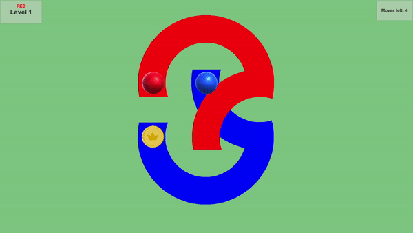

# Circulation

A prototype of a small puzzle game in which you control 2 dots where each dot can only be moved in a circular motion relative to the other dot. 

Your goal is to reach the goal coin with one of the dot by consequential circular motions (where each dot has its own allowed track to follow) in limited amount of turns.

